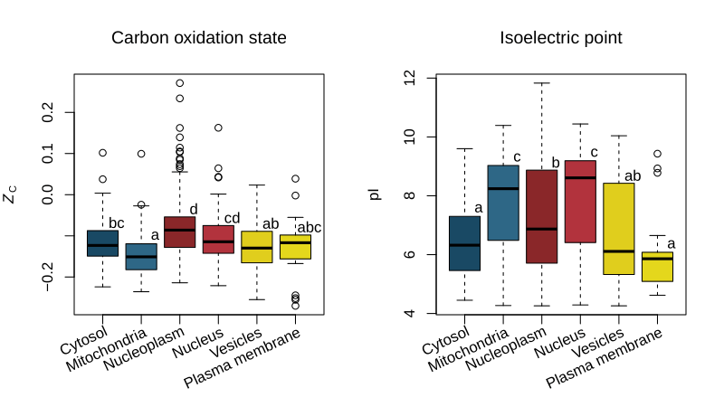

<!-- badges: start -->
[](https://cran.r-project.org/package=canprot)
[](https://doi.org/10.5281/zenodo.3544985)
[](https://github.com/jedick/canprot/actions/workflows/R-CMD-check.yaml)
<!-- badges: end -->

# canprot

Chemical analysis of proteins based on their amino acid compositions.
Amino acid compositions can be read from FASTA files and used to calculate chemical metrics
including carbon oxidation state and stoichiometric hydration state as described in [Dick et al.(2020)](https://doi.org/10.5194/bg-17-6145-2020).
Other properties that can be calculated are protein length, grand average of hydropathy (GRAVY), isoelectric point (pI), molecular weight (MW),
standard molal volume (V0), and metabolic costs
([Akashi and Gojobori, 2002](https://doi.org/10.1073/pnas.062526999);
[Wagner, 2005](https://doi.org/10.1093/molbev/msi126);
[Zhang et al., 2018](https://doi.org/10.1038/s41467-018-06461-1)).
A database of amino acid compositions of human proteins derived from UniProt is provided.

See the vignettes at <https://chnosz.net/canprot/vignettes>.

## Installation

Install the development version from GitHub to use the `read.fasta()` function that was previously in [CHNOSZ](https://github.com/jedick/CHNOSZ).

First install the **remotes** package from CRAN, then install **canprot** from GitHub.
This also installs several other R packages as dependencies:

```R
install.packages("remotes")
remotes::install_github("jedick/canprot")
```

Use this instead to install the released version from CRAN (his version does not have all the features in the development version).

```R
install.packages("canprot")
```

### Demo

```R
demo("canprot")
```



These plots show carbon oxidation state (*Z*<sub>C</sub>) and isoelectric point (pI) for human proteins in different subcellular locations.
The localization data is from Table S6 of [Thul et al. (2017)](https://doi.org/10.1126/science.aal3321) (*A subcellular map of the human proteome*), filtered to include proteins that have both a validated location and only one annotated location.
