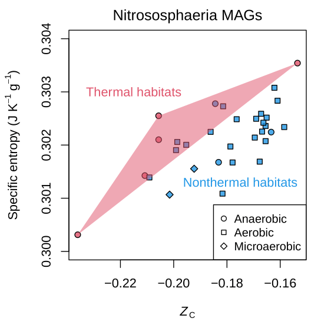
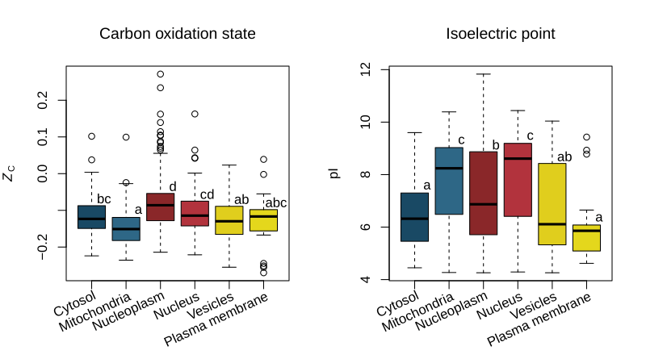

<!-- badges: start -->
[](https://cran.r-project.org/package=canprot)
[](https://github.com/jedick/canprot/actions/workflows/R-CMD-check.yaml)
[](https://app.codecov.io/gh/jedick/canprot)
<!-- badges: end -->

# canprot

Chemical analysis of proteins based on their amino acid compositions.
Amino acid compositions can be read from FASTA files and used to calculate chemical metrics
including carbon oxidation state and stoichiometric water content as described in [Dick et al. (2020)](https://doi.org/10.5194/bg-17-6145-2020).
Other properties that can be calculated include protein length, grand average of hydropathy (GRAVY), isoelectric point (pI), molecular weight (MW),
standard molal volume (V0), and metabolic costs
([Akashi and Gojobori, 2002](https://doi.org/10.1073/pnas.062526999);
[Wagner, 2005](https://doi.org/10.1093/molbev/msi126);
[Zhang et al., 2018](https://doi.org/10.1038/s41467-018-06461-1)).
A database of amino acid compositions of human proteins derived from UniProt is provided.

See the vignettes at <https://chnosz.net/canprot/vignettes/>.

## Installation

First install the **remotes** package from CRAN, then install **canprot** from GitHub.
This also installs several other R packages as dependencies:

```R
install.packages("remotes")
remotes::install_github("jedick/canprot")
```

### Demo

Three demos are available.
One of them is shown below.

```R
demo("thermophiles")
#demo("locations")
#demo("redoxins")
```

<a href="https://chnosz.net/canprot/vignettes/demos.html"></a>

This is a scatter plot of standard specific entropy (*S*<sup>&deg;</sup> per gram) and carbon oxidation state (*Z*<sub>C</sub>) for proteins in *Nitrososphaeria* (syn. *Thaumarchaeota*) metagenome-assembled genomes (MAGs) reported by [Luo et al. (2024)](https://doi.org/10.1093/ismejo/wrad031).
*S*<sup>&deg;</sup> is calculated using amino acid group contributions ([Dick et al, 2006](https://doi.org/10.1111/gbi.12532)) via `canprot::S0g()`.
This plot reveals that proteins tend to have higher specific entropy in MAGs from thermal habitats compared to those from nonthermal habitats with similar carbon oxidation state.
This implies that, after correcting for *Z*<sub>C</sub>, proteins in thermophiles have a <ins>more negative derivative</ins> of the standard Gibbs energy per gram of protein with respect to temperature.
See the [Demos for canprot](https://chnosz.net/canprot/vignettes/demos.html) vignette for a similar plot for genomes of methanogenic archaea.

<!--



These plots show carbon oxidation state (*Z*<sub>C</sub>) and isoelectric point (pI) for human proteins in different subcellular locations.
The localization data is from Table S6 of [Thul et al. (2017)](https://doi.org/10.1126/science.aal3321) (*A subcellular map of the human proteome*), filtered to include proteins that have both a validated location and only one annotated location.

-->
